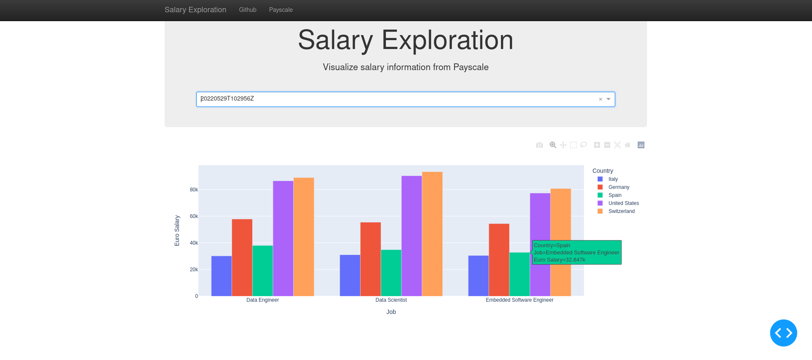

# Salary exploration

## Introduction
 
The idea is to automatically search on [payscale.com](https://www.payscale.com/) the salary for a list of jobs in different countries and visualize the results with a Dash web application.

## Software and Libraries

This project uses Python 3.9.2 and the following libraries:
* [Pandas](http://pandas.pydata.org)
* [Selenium](https://pypi.org/project/selenium/)
* [dash](https://dash.plotly.com/)

More informations in `requirements.txt`. To create it I have used `python -m pip freeze > requirements.txt`. To install all Python packages written in the requirements.txt file run `pip install -r requirements.txt`.

## Data

The data is scraped from [payscale.com](https://www.payscale.com/)

Using the url `https://www.payscale.com/research/IT/Job=Data_Engineer/Salary` we can see that is possible to automatically search the website by providing a country code and a job name.

After searching for each country and each job we have to convert the salary from local currency to a common one (i.e. Euro in my case)

## Running the code

From the project folder run `python dash_salary_exploration.py` to start the dash application. The default url to connect to it is http://127.0.0.1:8050/.

<pre>
|-- salary_exploration: project folder
    |-- dash_salary_exploration.py: web application module for visualize the data
    |-- salary_exploration.py: module for search organizazion
    |-- transform_data.py: module for data transformation
    |-- extract_data.py: module for data extraction
    |-- search: folder for the searching files
    |   |
    |   |-- countries.csv: list of countries to search
    |   |-- jobs.csv: list of jobs to search
    |
    |-- data: folder for the data
    |   |
    |   |-- YYYYMMDDTHHMMSSZ: folder for historicization of every search
    |   |
    |   |-- country_code_countries.pkl: file with the country code and country mapping
    |
    |-- README.md
    |-- TODO.md
</pre>

All the modules provide the help funcionality provided by [argparse](https://docs.python.org/3/library/argparse.html) module.

Every run is identified by the YYYYMMDDTHHMMSSZ date string.

## Results

The dash application 

Using the dropdown menu is possible to select the extraction to visualize.

## Licensing and Acknowledgements

Thanks [payscale.com](https://www.payscale.com/) for the data. Payscale offer a wide variety of products and services in the compensation technology. Check it out.